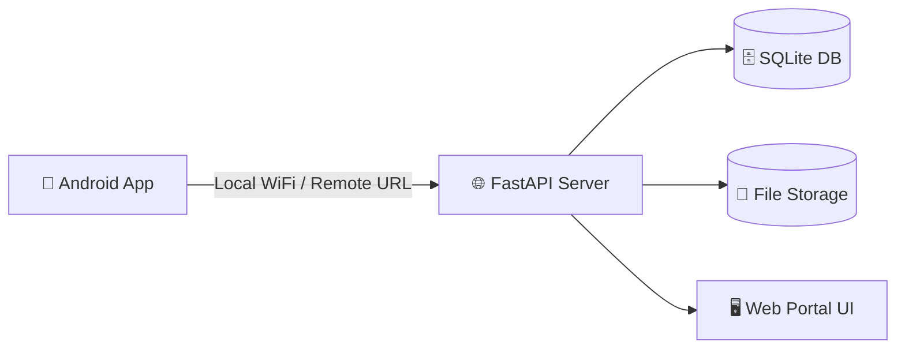

# 📸 PhotoSync Server

> 🔐 A private, self-hosted alternative to Google Photos — built for full control, performance, and family-scale sharing.

[]()
[]()
[]()
[]()

---

## 🔗 Ecosystem

- 📱 Android Client → https://github.com/sagarmakhija1994/PhotoSync-Android
- 🖥 Backend Server → (this repo)

---

## ✨ What is PhotoSync?

PhotoSync is a **self-hosted, multi-user photo & video sync platform** that gives you:

- Full ownership of your data
- No cloud dependency
- Fast local transfers + remote access
- Private family sharing network

---

## ⚡ Quick Start

### 🪟 Windows (Recommended)

👉 **Download & Install**
- Go to **Releases**
- Download `.exe`
- Install & Run

Then open:
http://127.0.0.1:8000/admin

---

### 🧑‍💻 Manual Setup

```bash
git clone <repo-url>
cd photosync

python3.13 -m venv venv
source venv/bin/activate  # Windows: venv\Scripts\activate

pip install -r requirements.txt

uvicorn app.main:app --host 0.0.0.0 --port 8000
```

---

## 🏗 Architecture



---

## 🌟 Key Features

### 📦 Storage & Sync
- Multi-user isolated storage
- SHA-256 deduplication
- Original folder structure preserved

---

### 🌐 Smart Networking
- Dual URL system (Local + Remote)
- Dynamic port routing
- Optimized media delivery

---

### 🖥 Web Portal (v1.5)
- Integrated UI (no separate frontend)
- Lightbox viewer
- Smooth loading
- Ultrawide support

---

### 🪟 Windows App
- One-click installer
- Bundled FFmpeg + UI
- No setup required

---

### ⚙️ System Tray
- Open Web Portal
- Change port
- Auto restart

---

### 🔐 Security
- JWT authentication
- Session invalidation
- bcrypt / argon2

---

### 👨‍👩‍👧 Social Features
- Follow system
- Album sharing
- One-tap import

---

### 🛠 Advanced
- `/server-info` API
- Git LFS
- High-load stability

---

## 📁 Project Structure

```
photosync/
├─ app/
├─ dist/
├─ bin/
├─ requirements.txt
└─ README.md
```

---

## 🔧 Admin Setup

Open:
http://127.0.0.1:8000/admin

---

## 📡 Health Check

```bash
curl http://127.0.0.1:8000/health
```

---

## 👨‍💻 Author

Sagar Makhija

---

## 📜 License

Private / Internal Use
